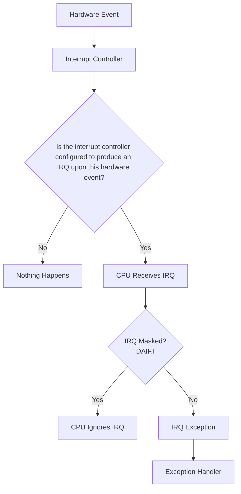

<big> Below chapter is currently under progress </big>

# Chapter 7: Timer And Interrupts

You may already know what interrupts are by now. Typically in general computer science langauge, an interrupt simply means temporarily stopping the execution of some set of instruction and executing some instructions at a completely different location. Then returning back to the original set of instructions whose execution was interrupted. 

Of course this is not a new concept to you at all. You have already seen this kind of behaviouor in earlier chapters. Which is hardware exceptions of course. In chapter 3 we set up a way to catch hardware exceptions, and once our handler is done handling the exception, it returns the `PC` back to where it was; right before it got sent to the exception handler. You are very familiar with this procedure by now. 

Now as you may remember, we learned that there were four kinds of exceptions that can occur. There was the synchronous, IRQ, FIQ, and SError. These exceptions trigger the CPU to prompt it to do some sort of handling for them. We have also seen through the chapter 5 on syscalls, that it is possible to have manually triggered exceptions for the sake of some manual prompt to the kernel. To be exact we are talking about the `svc` instruction. Which upon execution, immediately causes an exception in the EL1 space under the type "Synchronous exception". It is called a synchronous exception because it occured directly do to the execution of instructions in the EL0 space. Execution cannot conitnue without synchronous exceptions being handled. However in this chapter we will learn about a kind of exception of the type IRQ or FIQ. 

## IRQ Exceptions

Now, the full form of IRQ is "Interrupt Request". These exceptions are typically caused whenever a hardware event occurs. So an hardware event that you *may* want to watch for and do something on is notified to the CPU by the hardware as an IRQ exception. It may not be something which needs handling for the current code execution to continue. An example of an hardware event is a USB device being plugged in. If your program is not trying to do anything with USB peripherals, then it likely can continue execution without caring about USB devices being connected or disconnected. Notice how these exceptions are categorzed as interrupt *requests*. This implies that somewhere in the chain of the hardware event occurring, and the CPU handling the event as a IRQ exception, there is an *option* presented. An option that lets you choose whether or not this interrupt is worth accepting by the CPU. We will talk about this more in detail later.

## Hardware event to IRQ pipeline

Now, whenever an hardware event occurs on your machine, in some way, the electronics on your hardware recognize that event, identify that event, and send an appropriate exception to the CPU. Obviously it is not the CPU chip on the hardware which monitors every single peripheral and peripheral for possible events. There is a different part of the hardware which does this job. That part is called the **Interrupt Controller**.

The interrupt controller is a component on the hardware whose job is to be the central hub of recognizing hardware events and notifying the CPU by sending an appropriate exception. Hardware events upon occuring are recognized by the interrupt controller (by signals received from the part of hardware where event occured). And then the interrupt controller records it, and triggers an IRQ exception to the CPU. There are two points in this pipeline which can be configured. First is the interrupt controller itself. It can be configured to choose which hardware events should cause an IRQ exception to the CPU, and which ones shouldn't. Next, the CPU itself can also be configured on if certain category of exceptions should straight up be ignored by it. 

So, the pipeline looks something like this:



```
┌─────────────────────────────┐
│      Hardware Event         │
└──────────────┬──────────────┘
               │
               ▼
┌─────────────────────────────┐
│   Interrupt Controller      │
└──────────────┬──────────────┘
               │
  Is the interrupt controller
  configured to produce an IRQ   
    upon this hardware event?
         ┌─────┴───────┐
         │             │
       No│             │Yes
         ▼             ▼
 Nothing happens   CPU receives IRQ signal
                       │
                       ▼
             is the CPU configured 
            to accept IRQ interrupts 
                  right now?
             ┌────────┴──────────┐
             │                   │
          Yes│                   │No
             ▼                   ▼
      CPU ignores IRQ   An IRQ Exception occurs 
                              in our CPU
                                  │
                                  ▼
                         EL1 Exception Handler
```


[hardware event]
       ↓
[interrupt controller] 
       ↓
is the interrupt controller   (no)
configured to produce an IRQ   ->  nothing happens
upon this hardware event?
       ↓ (yes)
     [CPU] receives IRQ signal
       ↓
is the CPU configured 
to accept IRQ interrupts 
right now? 
       ↓ (yes)
An IRQ Exception occurs 
in our CPU